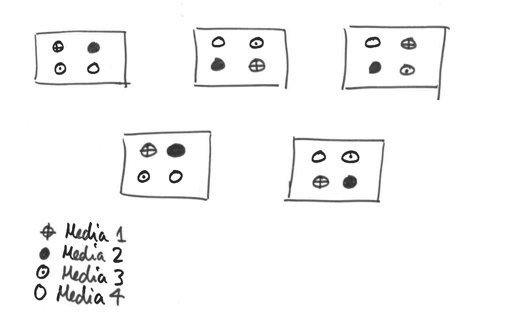
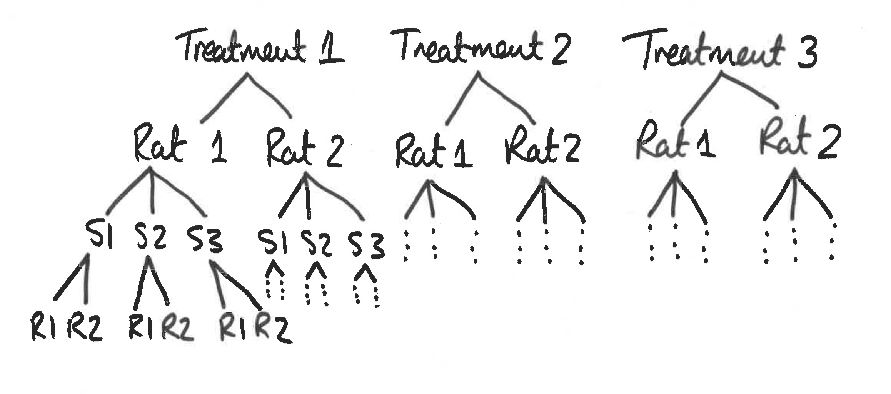
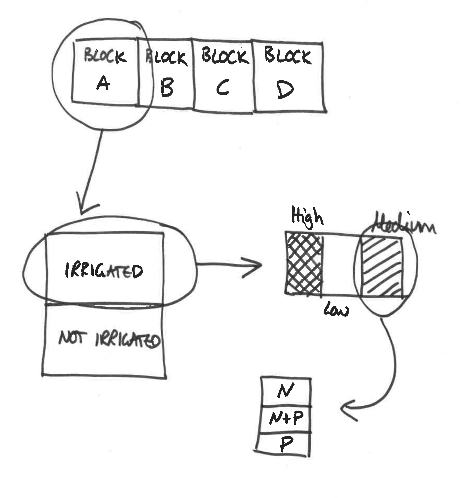

# Mixed effects models

```{r, include = F, purl = F, cache = F}
opts_chunk$set(titles = c(ifelse(opts_knit$get("rmarkdown.pandoc.to") != "latex", "<tt>tidyverse</tt>", "\\texttt{tidyverse}"), "Base R"))
```

My thanks in particular to [Dave Hodgson](http://biosciences.exeter.ac.uk/staff/index.php?web_id=david_hodgson), who's fantastic Master's course offered up the prototype for this workshop.

Firstly, install if necessary (using `install.packages()`; uncomment the code below if required) and load the `lme4` package [@lme4]:

```{r, message = F, warning = F}
## load libraries
library(tidyverse)
library(lme4)
```

> **Note**: In this session I will use `tidyverse` as the principal way to generate plots etc. because it's ***far*** easier for many of the examples in this workshop. The base R code is provided for those of you that are not familiar with `tidyverse`.

This practical will focus on how to analyse data when the experimental design (or the surveyed explanatory variables) obliges us to study non-independent experimental units. You will find yourself distinguishing between random effects and fixed effects. You will find yourself frustrated at the lack of consensus regarding how to simplify fixed factors in mixed models. It takes a long time to understand how to deal with blocks (and other random effects): don't expect understanding to come overnight, and do rely on books and websites to help you. But be warned, at this level of statistical prowess, much of the literature is written in Greek symbols and matrix algebra.

***Health Warning: some of these mixed-effects modelling packages are quickly evolving, and future updates might play some havoc with the coding, and outputs from, the scripts written here. You will need to keep your eye on the forums in the future if this happens. As always, let me or your demonstrators know if you encounter difficulties.***

## A note on variable selection and model simplification

By design we have been a bit wary in focusing on the eponymous null hypothesis significance testing (NHST) ideas (and associated idolisation of p-values). We have done this because we want to emphasise that a statistical model is more than just a p-value, and also that a p-value on its own (without some measure of effect size) is meaningless. We appreciate that this might fly in the face of the way that you might have seen statistical models presented in courses or papers, and this section is our attempt to explain to you some of the controversies surrounding these approaches.

There are many philosophical complexities with the way that p-values are used in many papers, and there have been many papers published discussing their misuse and misinterpretations. A good one is [Halsey et al. (2015)](https://www.nature.com/articles/nmeth.3288.pdf?origin=ppub). 

This is not to say that null hypothesis significance testing (hereafter NHST) is wrong, it's just that it's easy to misuse, even for experienced data modellers. Here are some common challenges / misconceptions:

1. A p-value is the *"probability of observing a test statistic equal to or more extreme than the observed test statistic if the null hypothesis is true"*; it is **not** the *"probability that the null hypothesis is false"*.
2. Leads to a binary interpretation: *"is there an effect?"*", rather than, *"what is the size of the effect"*?
3. They are heavily dependent on **sample size**:
    * a *larger* study with the same effect size and variance will be *more* statistically significant.
    Example: study is exploring differences between sample means from two groups, $\bar{x}$ and $\bar{y}$.
        * $~~\bar{x} = 10$, $\bar{y} = 12$, $s = 5$ (pooled SD), $n = 5$ (per group): $\mathbf{p = 0.4}$.
        * $~~\bar{x} = 10$, $\bar{y} = 12$, $s = 5$ (pooled SD), $n = 30$ (per group): $\mathbf{p = 0.0332}$.
4. The p-value itself is a **random variable**, and can have a very wide variance
    * Geoff Cumming's ['dance of the p-values'](https://www.youtube.com/embed/5OL1RqHrZQ8).
    * Type I, II, S and M errors.
5. Often, the null hypothesis of a **zero effect** is not a **biologically** valid one.
    * [The difference between "significant" and "not significant" is not itself statistically significant...](http://www.tandfonline.com/doi/abs/10.1198/000313006X152649)
6. Direction and magnitude of effects are important.
    * Consider a **large** study which finds a **small** effect size of $x$ ($p < 0.001$), with the **minimum biologically significant** effect size being ***larger*** than $x$.
    * Therefore, the ***highly (statistically) significant*** p-value provides strong evidence of a **lack-of-effect**. It corresponds to a **negligible real-world** effect estimated with high precision!
    
Many of these problems go away when a study is appropriately **powered**, with careful experimental design. In this case the sample size is large enough to have high power for the comparison of interest, and the study is often set up in such a way as to make the comparison of interest meaningful. Note that these kinds of study were what NHST were derived to model.

That being said, there are times when NHST can be useful, particularly if you have a complex system (perhaps with large numbers of explanatory variables), and you wish to produce a more parsimonious model (perhaps because it is easier to interpret). Traditionally, if the response variable is Gaussian (normal), then you may have come across two frequently used approaches:

* F-tests: based on comparing the residual mean squared error with the regression mean squared error, or
* Likelihood ratio tests (LRT): based on comparing the model deviance between two models.

Both of these cases are **exact** tests for linear regression with Gaussian errors (but for mixed models these become approximate). Let's have a look at a simple example using the fruitflies data from earlier practicals. These data are available in the ["fruitfly.rds"](https://exeter-data-analytics.github.io/StatModelling/_data/fruitfly.rds) file.

```{r, eval=FALSE}
ff <- readRDS("fruitfly.rds")
```

```{r, echo=FALSE, eval=TRUE}
ff <- readRDS("_data/fruitfly.rds")
```

```{r}
ff_lm <- lm(longevity ~ type, data = ff)
summary(ff_lm)
drop1(ff_lm, test = "F")
```

Here the `drop1()` function drops each explanatory variable in turn from the baseline model and performs an F-test. The null hypothesis can be thought of as *"if the fit from the competing models is the same"*. 

Here there is only one variable, `type`, and so dropping this variable produces a test statistic of 15.738, which can be compared against an F-distribution on 2 and 122 degrees-of-freedom (d.f.), which gives a p-value of $8.3 \times 10^{-7}$ (i.e. a statistically significant change even at the 1% and 0.1% levels). Thus we would conclude that dropping `type` produces a statistically significantly inferior model fit compared to when it is left in the model.

We can do the same thing but using a likelihood ratio test as:

```{r}
drop1(ff_lm, test = "Chisq")
```

Here the test statistic produces a p-value of $5.9 \times 10^{-7}$; again highly statistically significant even at the 0.1% level, but slightly different to the F-test (because they are different tests). Here we are comparing to a chi-squared distribution on 2 d.f. (the difference in the number of parameters between the two nested models). In general, in linear regression with Gaussian errors the F-test is slightly more powerful than the LRT, but you can use either.

For Generalised Linear Models (GLMs) with non-Gaussian error structure the F-test is no longer valid, and the LRT is **approximate** (the latter is in fact **asymptotically chi-squared**, which means that the approximation gets better for larger sample sizes, but can be misleading in small samples).

If using F-tests or LRTs to compare models, then the models must be **nested** (i.e. you can get one model to equal the other by fixing some of the parameters---usually setting coefficients to be zero, as in the fruitflies example). An alternative is to use something like Akaike's Information Criterion (AIC), which does not assess statistical significance and does not require the models to be nested (it is in essence a measure of predictive accuracy).

For **mixed models** things get trickier again, and there is much debate about optimal ways to perform model simplification and inference---see [GLMM FAQ](https://bbolker.github.io/mixedmodels-misc/glmmFAQ.html) for more discussion. A nice description of the types of approaches we can use in different cases can be found at:

[https://rdrr.io/cran/lme4/man/pvalues.html](https://rdrr.io/cran/lme4/man/pvalues.html)

The developers of `lme4` recommend (from **worst** to **best**)^[see [GLMM FAQ](https://bbolker.github.io/mixedmodels-misc/glmmFAQ.html)]:

* Wald Z-tests;
* For **balanced**, **nested LMMs** where degrees of freedom can be computed according to classical rules: Wald t-tests;
* Likelihood ratio test, either by setting up the model so that the parameter can be isolated/dropped (via `anova()` or `drop1()`, or via computing likelihood profiles;
* Markov chain Monte Carlo (MCMC) or **parametric bootstrap confidence intervals**.

If I do perform model simplification or variable selection, even then I would present the final model results in terms of effect sizes and confidence intervals where possible (or via predictive plots), since although CIs suffer with some of the same problems as p-values, at least they focus on the magnitude of the effects. If I have large enough sample sizes and not too many variables, then it may well be fine just to fit one model and perform inference from that.

In this workshop we will introduce some common scenarios in which mixed models can be applied, and give examples of model simplification and inference in these cases. We will tend to use LRTs and profile confidence intervals simply because they are easier to compute. A [section](#parboot) at the end will explore the use of parametric bootstrapping.

## Non-independent data: Randomised Complete Block Design

> Often you will find it impossible to allocate treatments to experimental units at random because they are structured in time or in space. This means that units are not independent of each other, hence their residuals will not be independent, and we have violated an important assumption of generalised linear modelling (and, indeed, of analysis of variance). However the recognition of natural structuring in our population of experimental units can be **very** useful. If the experimental design can be stratified so that all units that share a common 'trait' (e.g. share a corner of a field, or share a single incubator) can represent one or more full replicate of the proposed experiment, then we should use this natural structuring to absorb some of our enemy: noise (also called residual deviance).

An extreme case of using error-absorbers is the Randomised Complete Block Experimental Design. So-called because it includes blocks, each block contains a single replicate of the experiment, and experimental units **within** blocks are allocated to treatment combinations **at random**. The concept is best explained using an example.

A microbiologist wishes to know which of four growth media is best for rearing large populations of anthrax, quickly. However, this poorly funded scientist does not own a large enough incubator in which to grow lots of replicate populations. Instead he requests space in five different incubators owned by other, better-funded researchers. Each incubator just has space for four bottles of medium. Our scientist allocates each growth medium to one bottle per incubator **at random**, inoculates with anthrax then monitors population growth rate.

A schematic is given in Figure \@ref(fig:bacCabinets).

```{r, bacCabinets, fig.cap = "Schematic for bacterial growth example", echo = F, out.width = "80%", out.height = "80%"}

```

The data are available in the 'bacCabinets.rds' file.  These data are available in the ["bacCabinets.rds"](https://exeter-data-analytics.github.io/StatModelling/_data/bacCabinets.rds) file. Read in this dataset and familiarise yourself with its structure. 

```{r, echo = F}
bac <- readRDS("_data/bacCabinets.rds")
```

```{r, eval = F}
bac <- readRDS("bacCabinets.rds")
```

Let's do the analysis **wrongly** to begin with:

```{r bacwrong}
bac_lm <- lm(growth ~ media, data = bac)
drop1(bac_lm, test = "F")
```

```{task, title = "Question"}
Why is this wrong?
```

```{solution, title = "Answer"}
Because the analysis does not account for the cabinet effects. There are not 20 *independent* measurements here.
```

Let's refit the model with a `cabinet` effect, and then test for the statistical significance of `media`:

```{r}
bac_lm <- lm(growth ~ media + cabinet, data = bac)
drop1(bac_lm, test = "F")
```

This is better. We need a `cabinet` effect here to deal with the fact that measurements within cabinets are not independent. Notice that the sum-of-squares for `media` is the same in this model compared to the one without `cabinet` in it. This is because we have a **balanced design** (i.e. the same number of measurements in each combination of explanatory variables). However, the F-statistic is different, and this is because this depends on the **residual sum-of-squares**, which is the second model is different due to the inclusion of `cabinet`, which soaks up some of the residual variance that can be attributed to differences between cabinets.

> **Note**: here the `cabinet` effect **must** be included in the model. It does not make sense for us to drop the `cabinet` effect and test for whether it should be included or not. It needs to be included **by design**! Hence we can ignore the `cabinet` line output by `drop1()`.

```{task}
Try with an **interaction** effect between `media` and `cabinet`. What happens and why?
```

```{solution}

``{r}
summary(lm(growth ~ media * cabinet, data = bac))
``

We are faced with all these `NA`s because the model is **saturated**: there is no replication so we cannot calculate the residual deviance/variance. This also means that there are no degrees-of-freedom remaining in the model to calculate the residual sum-of-squares. We have twenty observations and twenty parameters to estimate. This is analogous to fitting a straight line through *two* data points; we get a perfect fit, and thus overfits.
```

### Mixed model approach

Let's re-do this analysis using a **mixed model**. If you haven't already, you will need to load the `lme4` package:

```{r, eval = F}
library(lme4)
```
    
> **Fixed and random effects**: 
> 
> * `media` is a **fixed** effect---we chose the media to be tested, each media has a specific identity, we want to estimate the differences in bacterial growth between different media;
> * `cabinet` is a **random** effect---we don't care about the identity of each cabinet, each cabinet is sampled from a population of possible cabinets, we just want to predict and absorb the variance in bacterial growth rate explained by cabinet.

Now on with the analysis:

```{r bac_lmer}
bac_lmer <- lmer(growth ~ media + (1 | cabinet), data = bac)
summary(bac_lmer)
```
    
> **Syntax for `lmer`**: The `lmer` command has two important sections:
> 
> * The first part corresponds to the 'fixed effects' part of the model (in this case, `growth ~ media`), which is identical to the model you would enter into `glm` if there were no problems of non-independence of data. 
> * The second part is where you enter the 'random effects' part of the model, where you tell R how the data is nested and where the non-independence lies. There is a whole world of possibilities here, from spatially autocorrelated variance/covariance matrices to independently varying random slopes and intercepts. We keep it simple in this course. For this example, we assume no interaction between media and cabinet, hence we just want to predict and absorb the additive variance due to different cabinets. Hence our random effect term is `(1 | cabinet)`. This means: 'the intercept of our linear model will vary according to cabinet'.
> 

Mathematically this corresponds to:
$$
    Y_i = \beta_0 + \beta_1 x_{i1} + \beta_2 x_{i2}+ \beta_3 x_{i3} + \gamma_{C_i} + \epsilon_i
$$
where $\epsilon_i \sim N(0, \sigma^2)$, the $x_{i*}$ are dummy **binary** variables corresponding to each level of `media`. For example:
$$
    x_{i1} = \left\{ \begin{array}{ll}
    1 & \mbox{if measurement $i$ has `media` = 2}\\
    0 & \mbox{otherwise},
    \end{array}
    \right.
$$
and similarly for $x_{i2}$ and $x_{i3}$. Here $\gamma_{C_i}$ is the random effect term for each `cabinet` ($C_i = 1, \dots, 5$). The reason why $\gamma_{C_i}$ are denoted as **random** effects, is that we assume they come from some distribution such that $\gamma_{j} \sim N(0, \sigma^2_{\gamma})$ (for $j = 1, \dots, 5$). I promise this will be the last equation in these notes!

#### **REML** vs. **ML**

To fit these models we use an approach called **maximum likelihood** (**ML**). ML is a very general technique with desirable *asymptotic* properties. However, ML estimators can be **biased**, particularly for small sample sizes. In mixed models an alternative approach, known as **restricted maximum likelihood** (**REML**), can be used, which produces better estimates of the model coefficients, particularly for small sample sizes. However, the REML likelihood function is different to the ML likelihood function, and only makes sense for mixed models (since it's designed to estimate the variance components). 

We may have to switch between these two approaches depending on what we want to do. In general, if you want to compare nested models that only differ in the random effects, then you can use either REML or ML. However, if you want to compare models that differ in their fixed effects, then you need to use ML. Hence, if we are performing variable selection or model simplification, then we may have to switch to ML when comparing models, but then refit the model using REML in order to produce estimates of the coefficients.

> **NOTE:** for various reasons the authors of `lme4` do not provide p-values as standard from a call to `summary()` or `anova()`. We can perform a **likelihood ratio test** for the impact of dropping `media` from the fitted model. The simplest way to do this is to use the `drop1()` function:
> 
> In order to use likelihood ratio tests for assessing the impact of dropping **fixed** effects, we must refit the model using ML (rather than REML). Here we will do this *in situ*, using the `update()` function and setting the argument `REML = F`. This does not change the original `bac_lmer` model object

```{r, warning = F, message = F}
drop1(update(bac_lmer, REML = F), test = "Chisq")
```
    
We have used a **likelihood ratio test** to assess whether the removal of `media` corresponds to a statistically significantly inferior model fit, which in this case it does at both the 5% and 1% levels. Hence we should leave `media` in the model. Once we have the final model, we can look at a sumamry of the model fit:

```{r}
summary(bac_lmer)
```

**Note** that this summary has been produced from the model fit using REML, even though the LRT was conducted using the model fitted using ML---this is because we updated the model *in situ* within `drop1()`. The 'intercept' of the `lmer` model is the mean growth rate in `media1` for an **average** cabinet. `lmer` output also gives you information criteria about the model, tells you the standard deviation of the random effects, correlations between levels of fixed effects, and so on. 

> **Note**: we use a likelihood ratio test (LRT) here, rather than an F-test. The F-test would be OK in this particular case, with Gaussian error structure and fully balanced design. However, LRTs are more general, and thus for consistency I will use these (or AIC) throughout where required.

We can derive confidence intervals using `confint()`, and also produce predictions from the model using `predict()`.

```{task}
Produce a 97% confidence interval for each regression coefficient of the model. What do each of these coefficients mean?
```

```{solution}

``{r}
confint(bac_lmer, level = 0.97)
``

The first two terms are the CIs for $\sigma_{\gamma}$ and $\sigma$ respectively. The third term is the CI for bacterial growth within an **average** cabinet. The next three terms correspond to the difference in bacterial growth for `media` levels 2, 3 and 4, relative to `media` level 1. Each of these effects are statistically significantly different to the baseline `media` at the 3% level. The model suggests that `media3` and `media4` have attenuated growth compared to `media1`, whereas `media2` has exacerbated growth.

This approach uses the profile likelihood to calculate CIs. There is an option to `confint()` that allows you to calculate parameteric bootstrapped CIs if you prefer. The latter are likely to be more accurate, and thus are beneficial if your CI/p-value is hovering around the required level of statistical significance and you wish to improve this estimate. However, bootstrapping is a simulation-based approach and can be computationally expensive.

```

## Non-independent data: pseudoreplication, nested variance and derived variable analysis

We take an example from Sokal & Rohlf (1981). The experiment involved a simple one-way anova with 3 treatments given to 6 rats. The analysis was complicated by the fact that three preparations were taken from the liver of each rat, and two readings of glycogen content were taken from each preparation. This generated 6 pseudoreplicates per rat to give a total of 36 readings in all. A schematic is given in Figure \@ref(fig:rats).

```{r, rats, fig.cap = "Schematic for glycogen in rats example", echo = F, out.width = "80%", out.height = "80%"}

```

Clearly, it would be a mistake to analyse these data as if they were a straightforward one-way anova, because that would give us 33 degrees of freedom for error. In fact, since there are only two rats in each treatment, we have only one degree of freedom per treatment, giving a total of 3 d.f. for error. 
 
The variance is likely to be different at each level of this nested analysis because: 
 
1. the readings differ because of variation in the glycogen detection method within each liver sample (measurement error);
2. the pieces of liver may differ because of heterogeneity in the distribution of glycogen within the liver of a single rat;
3. the rats will differ from one another in their glycogen levels because of sex, age, size, genotype, etc.;
4. rats allocated different experimental treatments may differ as a result of the fixed effects of treatment. 

If all we want to test is whether the experimental treatments have affected the glycogen levels, then we are not interested in liver bits within rat's livers, or in preparations within liver bits. We could combine all the pseudoreplicates together, and analyse the 6 averages. This would have the virtue of showing what a tiny experiment this really was. This latter approach also ignores the nested sources of uncertainties. Instead we will use a linear mixed model.
 
The new concept here is that there are multiple random effects that are **nested**.  These data are available in the ["rats.rds"](https://exeter-data-analytics.github.io/StatModelling/_data/rats.rds) file. First, read in the data:

```{r, echo = F}
rats <- readRDS("_data/rats.rds")
summary(rats)
```

```{r, eval = F}
rats <- readRDS("rats.rds")
summary(rats)
```

### The Wrong Analysis 

Here is what not to do (try it anyway)!

```{r wrong} 
rats_lm <- lm(Glycogen ~ Treatment * Rat * Liver, data = rats)
```

The model has been specified as if it were a full factorial with no nesting and no pseudoreplication. Note that the structure of the data allows this mistake to be made. It is a very common problem with data frames that include pseudoreplication. An ANOVA table gives:

```{r}
anova(rats_lm, test = "F")
```

> **Note**: I can only use the `anova()` function in this way because the data are **balanced** (or at least the model formulation above with no nesting and no pseudoreplication ends up treating the data as if they were balanced). In general you have to be very careful to use `anova()` in this way.

This says that there was a highly statistically significant difference between the treatment means, at least some of the rats were statistically significantly different from one another, and there was a statistically significant interaction effect between treatments and rats. **This is wrong!** The analysis is flawed because it is based on the assumption that there is only one error variance and that its value is 21.2. This value is actually the measurement error; that is to say the variation between one reading and another from the same piece of liver. For testing whether the treatment has had any effect, it is the rats that are the replicates, and there were only 6 of them in the whole experiment. Note also that the way the rats have been coded makes it look like there are only two rat "groups". Again this is wrong (see [mixed models](#secmixed) section below).

One way that we could analyse these data is to use a **derived variable** analysis. 
 
### Derived variables avoid pseudoreplication 

The idea is to get rid of the pseudoreplication by averaging over the liver bits and preparations for each rat. A useful way of averaging, in R, is to use `aggregate` (or `tidyverse`):

```{multCode}

``{r}
ratsNew <- rats %>%
    group_by(Rat, Treatment) %>%
    summarise(Glycogen = mean(Glycogen))
ratsNew
``

####

``{r}
ratsNew <- aggregate(Glycogen ~ Rat + Treatment, data = rats, mean)
ratsNew
``

```

Here, `ratsNew` is a new dataset (hopefully shorter than its ancestral dataset) but has the same column headings as `rats`. (Hence be careful to specify the **correct** data set using the `data` argument where necessary.)

```{r ratsagg}
ratsNew_lm <- lm(Glycogen ~ Treatment, data = ratsNew)
drop1(ratsNew_lm, test = "F")
```

This is a statistically valid analysis, but it ignores the uncertainties around the pseudo-replicates, and the interpretation of the response variable is actually the mean of a bunch of measurements, not the measurements themselves. So it's giving the correct result for a different model, and ultimately not the model we want.

### Mixed model approach {#secmixed}

#### Nested and crossed random effects

We have to be careful to get the model formula correct. Notice that in the `rats` data the `Rat` column is coded as a `1` or a `2`. This means that we could use the formula:

```{r, eval = F}
rats_lmer <- lmer(Glycogen ~ Treatment + (1 | Rat), data = rats)
```

**without** throwing an error.

```{task, title = "Question"}
Why is this wrong?
```

```{solution, title = "Answer"}
It is wrong because this would add **two** random effect terms, one for rat `1` and one for rat `2`. In fact there are 6 rats altogether. The way that the data have been coded allows for these kinds of mistakes to happen. The same is true for `Liver`, which is coded as a `1`, `2` or `3`. This means that we could write:
    
``{r, eval = F}
rats_lmer <- lmer(Glycogen ~ Treatment + (1 | Rat) + (1 | Liver), data = rats)
``

thinking that we are including the correct random effects for `Rat` and `Liver`. In fact, this assumes that the data come from a **crossed** design, in which there are 2 rats and 3 parts of the liver, and that `Liver = 1` corresponds to the same type of measurement in rats `1` and `2` and so on. Sometimes this is appropriate, but not here!
    
The nature of the way that many data sets are coded makes these kinds of mistakes very easy to make!
```

In this case we must tell `lmer()` that `Liver` is **nested** within `Rat`, and `Rat` within `Treatment`. We can do this in various ways, but the easiest thing here is to generate a unique coding for each of the 6 rats.

```{multCode}

``{r, echo = F}
rats_orig <- rats
``

``{r}
rats <- rats %>%
    unite(Rat, Treatment, Rat, sep = "_", remove = F) %>%
    mutate(Rat = factor(as.numeric(factor(Rat))))
``

####

``{r, echo = F}
rats <- rats_orig
``

``{r}
rats$Rat <- paste(rats$Treatment, "_", rats$Rat)
rats$Rat <- factor(as.numeric(factor(rats$Rat)))
``

```

We can use **nested** random effects to account for the hierarchy of measurements:

```{r}
rats_lmer <- lmer(Glycogen ~ Treatment + (1 | Rat / Liver), data = rats)
drop1(update(rats_lmer, REML = F), test = "Chisq")
```

> **Note**: the syntax `Rats / Liver` means that the `Liver` levels are **nested** within the `Rat` levels. In this case we do not have to recode `Liver` to be unique, since the nesting ensures that `lmer()` knows that `Liver = 1` inside `Rat = 1` is different from `Liver = 1` inside `Rat = 2`.

## Non-independent data: Split-plot analyses

Split-plot experiments are like nested designs in that they involve plots of different sizes and hence have multiple error terms (one error term for each plot size). They are also like nested designs in that they involve pseudoreplication: measurements made on the smaller plots are pseudoreplicates as far as the treatments applied to larger plots are concerned. This is spatial pseudoreplication, and arises because the smaller plots nested within the larger plots are not spatially independent of one another. The only real difference between nested analysis and split plot analysis is that other than blocks, all of the factors in a split-plot experiment are typically fixed effects, whereas in most nested analyses most (or all) of the factors are random effects.  
 
This experiment involves the yield of cereals in a factorial experiment with 3 treatments, each applied to plots of different sizes within 4 blocks. The largest plots (half of each block) were irrigated or not because of the practical difficulties of watering large numbers of small plots. Next, the irrigated plots were split into 3 smaller split-plots and seeds were sown at different densities. Again, because the seeds were machine sown, larger plots were preferred. Finally, each sowing density plot was split into 3 small split-split plots and fertilisers applied by hand (N alone, P alone and N + P together). A schematic is given in Figure \@ref(fig:splityields).

```{r, splityields, fig.cap = "Schematic for split plot example", echo = F, out.width = "80%", out.height = "80%"}

```

The data look like:

```{r splityield0, echo = F}
splityield <- readRDS("_data/splityield.rds")
temp <- tapply(splityield$yield, rev(list(Block = splityield$block, Irrigation = splityield$irrigation, Fertiliser = splityield$fertilizer, density = splityield$density)), function(x) x)
temp.irr <- temp[, , "irrigated", ]
temp.cont <- temp[, , "control", ]
    
temp.irr <- do.call("rbind", lapply(1:4, function(i, x) x[, , i], x = temp.irr))
temp.cont <- do.call("rbind", lapply(1:4, function(i, x) x[, , i], x = temp.cont))
temp <- cbind(temp.cont, temp.irr)
temp <- cbind(rownames(temp), temp)
temp <- rbind(colnames(temp), temp)
colnames(temp) <- c("", "", "Control", "", "", "Irrigated", "")
rownames(temp) <- c("", "", "Block A", "","", "Block B", "","", "Block C", "","", "Block D", "")
temp[1, 1] <- "**Density / Fertiliser**"
library(pander)
panderOptions("table.split.table", Inf)
pander(temp, style = "rmarkdown", table.emphasize.rownames = F)
```

 These data are available in the ["splityield.rds"](https://exeter-data-analytics.github.io/StatModelling/_data/splityield.rds) file. First, let's read in the data and take a look at it.

```{r, eval = F}
splityield <- readRDS("splityield.rds")
head(splityield)
summary(splityield)
```

```{r, echo = F}
splityield <- readRDS("_data/splityield.rds")
head(splityield)
summary(splityield)
```

### Analysing split-plot designs using `lmer`

Now, how do we set up a mixed effects model to analyse these data? `block` is the only random effect but our data are nested. Our fixed effects are `irrigation`, `density` and `fertilizer`. Here is the model, including prediction of the variance due to block's random effect on the intercept of the model.

**Note**: Ordinarily we would write the nested random effect terms using the syntax:

```{r, error = TRUE, tidy = F}
split_lmer <- lmer(yield ~ irrigation * density * fertilizer + 
                       (1 | block / irrigation / density / fertilizer), data = splityield)
```

However, if you run this, you will notice that the function returns an error. This is because there are no replicates within the final nesting (i.e. the table above on has a single replicate in each cell). To overcome this we need to remove the final nesting. Unfortunately, this leads to a rather more horrible formula. 

Another way of writing the command above is:

```{r, eval = F, tidy = F}
split_lmer <- lmer(yield ~ irrigation * density * fertilizer + (1 | block) + 
                       (1 | block:irrigation) + (1 | block:irrigation:density) + 
                       (1 | block:irrigation:density:fertilizer), data = splityield)
```

Pretty grim eh? However, in this case we note that the final nested random effect only has one replicate per group, so we simply remove this term. Leaving:

```{r, tidy = F}
split_lmer <- lmer(yield ~ irrigation * density * fertilizer + (1 | block) + 
       (1 | block:irrigation) + (1 | block:irrigation:density), 
       data = splityield)
```

We can now perform model simplification (remembering to refit the model using ML in each case):

```{r}
drop1(update(split_lmer, REML = F), test = "Chisq")
```
We can see that the three-way interaction term is not statistically significant, so we can drop it from the model and then test dropping the two-way interaction effects.

```{r, tidy = F}
split_lmer <- update(split_lmer, ~ . - irrigation:density:fertilizer)
drop1(update(split_lmer, REML = F), test = "Chisq")
```

We are thus safe to remove the `density:fertilizer` interaction term:

```{r, tidy = F}
split_lmer <- update(split_lmer, ~ . - density:fertilizer)
drop1(update(split_lmer, REML = F), test = "Chisq")
```

We thus have a simplified final model. If you really want to know all the coefficients, type `summary(split.lmer)`, but here we will try to understand the interaction terms graphically.

A useful way to understand these is to use the `interaction.plot()` function. The variables are listed in a non-obvious order: first the factor to go on the $x$-axis, then the factor to go as different lines on the plot, then the response variable. There are 3 plots to look at so we make a $2 \times 2$ plotting area: 
 
```{r, fig.width = 10, fig.height = 10, fig.show = "hold"}
par(mfrow = c(2, 2))
interaction.plot(splityield$fertilizer, splityield$density, splityield$yield) 
interaction.plot(splityield$fertilizer, splityield$irrigation, splityield$yield) 
interaction.plot(splityield$density, splityield$irrigation, splityield$yield)
par(mfrow = c(1, 1))
```

The really pronounced interaction is that between irrigation and density, with a reversal of the high to low density difference on the irrigated and control plots. Overall, the 3-way interaction was not statistically significant, nor was the 2-way interaction between density and fertilizer. The 2-way interaction between irrigation and fertilizer, however, was highly statistically significant. 

Another way to visualise the model outputs would be to generate a plot of the predicted yield (plus confidence intervals), for each combination of explanatory factors. I have created a `data.frame` with these predictions using bootstrapping. The code to replicate this can be found [here](#parboot), but is a bit time consuming to run, so I have included the predictions as a file called ["split_pred.rds"](https://exeter-data-analytics.github.io/StatModelling/_data/split_pred.rds).

First, read in the predictions:

```{r, eval = F}
split_pred <- readRDS("split_pred.rds")
```

```{r, echo = F}
newdata <- readRDS("_data/split_pred.rds")
```

<a name="splitplot"></a>

Now to plot these predictions (note, once again these ease of `ggplot2` compared to base R graphics):

```{multCode}

In `ggplot2` we can use the `geom_pointrange()` function, a `colour` aesthetic and a `facet_wrap()`.

``{r, fig.width = 10, fig.height = 5}
## plot confidence intervals
ggplot(newdata, 
    aes(x = fertilizer, colour = density)) + 
    geom_pointrange(aes(y = yield, ymin = lci, ymax = uci), 
        position = position_dodge(width = 0.5)) +
    facet_wrap(~ irrigation) +
    labs(title = "CIs based on fixed-effects uncertainty ONLY")
``

####

To plot the CIs in base R, we can proceed as follows:

1. Set the figure layout to have two figures side-by-side.
2. Calculate limits for the $y$-axis based on the range of the CIs to be plotted.
3. Calculate manual limits for the $x$-axis to enable us to jitter the error bars around each fertiliser level.
4. For each level of `irrigation`: 
    * Extract the subset of data corresponding to the level of `irrigation`.
    * Produce an empty plot (setting the $y$-limits and $x$-limits). Remove the $x$-axis (using the `xaxt = "n"` argument). This latter step is so that we can add the `fertilizer` labels manually in the next step.
    * For each level of `density`:
        * Extract the subset of data corresponding to the level of `density`.
        * Sort this so that the levels of `fertilizer` are the same at each stage of the `i` loop^[at this point, `temp1` will have three rows, one for each level of `fertilizer`].
        * Add points for the estimates and add confidence intervals using the `arrows()` function^[I'll let you check the help file for `arrows()` to figure out the arguments and what they are doing]. Notice that I have used a `for` loop to allow me to plot the three CIs for each level of `fertilizer`. All that this loop does is to run the `arrows()` command 3 times, substituting `j` each time for the corresponding row of the sorted data set (which will be of length three here). You could do this explicitly in three lines of code if you prefer. Notice that I've jittered the points slightly so that the three levels of `density` can be plotted side-by-side.
    * Add a new $x$-axis and set appropriate labels for the points.
    * Add a legend.
    
Phew! (Now check out the `tidyverse` solution and tell me it's not worth the effort to learn `ggplot2`!)

``{r, fig.width = 10, fig.height = 5}

## set plot layout
par(mfrow = c(1, 2))
    
## set plot limits
ylims <- min(newdata[, -c(1:3)])
ylims <- c(ylims, max(newdata[, -c(1:3)]))
xlims <- c(0, 3.5)

for(m in levels(newdata$irrigation)) {
    ## extract control predictions
    temp <- newdata[newdata$irrigation == m, ]
    
    ## produce empty plot
    plot(NULL, ylim = ylims, xlim = xlims, 
         xaxt = "n", main = paste("irrigation =", m),
         xlab = "fertilizer", ylab = "yield")
    
    ## plot yield against fertiliser stratified by density
    for(i in 1:length(levels(newdata$density))) {
        temp1 <- temp[temp$density == levels(newdata$density)[i], ]
        temp1 <- temp1[order(temp1$fertilizer), ]
        for(j in 1:nrow(temp1)){
            points(j - 0.2 * (2 - i), temp1$yield[j], col = i, pch = 16)
            arrows(j - 0.2 * (2 - i), temp1$lci[j], j - 0.2 * (2 - i), temp1$uci[j], 
                length = 0.1, col = i, angle = 90, code = 3)
        }
    }
    
    ## add custom x-axis
    axis(side = 1, at = 1:3, labels = levels(newdata$fertilizer))
    
    ## add legend
    legend(0.1, diff(par("usr")[3:4]) * 0.95 + par("usr")[3], 
        legend = levels(newdata$density),
        col = 1:3,
        lty = 1,
        pch = 16)
}

## reset plot layout
par(mfrow = c(1, 1))

``

```

So we can see that in the control group the `medium` density sowing seems to produce slightly higher yields on average than the `low` or `high` density settings, but we note that these differences are not statistically significantly different at the 5% level. However, irrigation tends to not only produce higher yields on average (except for the `N` fertiliser), but also to favour `high` density sowing efforts, which are now much preferred over `low` density sowing efforts (although not too dissimilar from `medium` density efforts). The model tends to favour the `NP` fertiliser in all cases, though there's not much between `NP` and `P`.

> **Note**: This approach does now take into account the random effects variances or covariances. It is therefore likely to underestimate the variance. To account for these additional uncertainties is difficult. If you want a more consistent approach, go [Bayesian](#secbayes).

## Non-independent data: Absorbing the influence of random effects

Eight groups of students walked through Hell's Gate National Park and estimated the distance to groups of individuals of several species of mammalian herbivores. Here we work with data on distances to three key species: Thomson's gazelle, warthog and zebra. We are interested in whether distances to these animals differ among species, whether distances depend on animal group size, and also whether the relationship between distance and group size differs among species.  These data are available in the ["hg.rds"](https://exeter-data-analytics.github.io/StatModelling/_data/hg.rds) file.

A na&iuml;ve analysis would ignore the identity of the student group, and therefore treat all the distance observations as independent. It would probably fit a `lm` of distance against species, number and the interaction between species and number. My own exploration of the data suggests that raw distances are skewed, and that a log-transformation improves homoscedasticity and normality of residuals. So before analysing we do this transformation.

```{r, echo = F}
hg <- readRDS("_data/hg.rds")
```

```{r, eval = F}
hg <- readRDS("hg.rds")
```

```{r}
hg$ldist <- log(hg$Distance)
hg_lm <- lm(ldist ~ Species * Number, data = hg)
drop1(hg_lm, test = "F")
```

This suggests a statistically significant interaction between `Species` and `Number` ($F_{2, 456} = 5.78$, $p = 0.003$).

```{r sumhg}
summary(hg_lm)
```

The interaction appears to be driven by a decrease in distance with increasing group size, but only in zebras. We can draw the relevant figure (notice that this is where `tidyverse` comes into its own, with much more concise code resulting in a better plot).

```{multCode}

Generate 'fake' data in order to plot fitted lines:

``{r}
newdata <- expand.grid(
        Number = seq(min(hg$Number), max(hg$Number), length = 100),
        Species = levels(hg$Species)
    )
``

Now get the predicted values for the fake data, and back-transform log-distance to real distances, using the `exp` command:

``{r}
newdata <- newdata %>%
    mutate(Distance = exp(predict(hg_lm, newdata)))
``

Now plot the fitted lines against the observed data points:

``{r}
ggplot(hg, aes(x = Number, y = Distance, col = Species)) +
    geom_point() + 
    geom_line(data = newdata)
``

####

Generate 'fake' data in order to plot fitted lines:

``{r}
newdata <- expand.grid(
    Number = seq(min(hg$Number), max(hg$Number), length = 100),
    Species = levels(hg$Species)
)
``

Now get the predicted values for the fake data, and back-transform log-distance to real distances, using the `exp` command:

``{r}
newdata$Distance <- exp(predict(hg_lm, newdata))
``

Now plot the fitted lines against the observed data points:

``{r}
plot(Distance ~ Number, data = hg, type = "n")
points(Distance ~ Number, 
       data = hg, 
       subset = (Species == "thomsons gazelle"), 
       pch = 16)
points(Distance ~ Number, 
       data = hg, 
       subset = (Species == "warthog"), 
       pch = 16,
       col = "red")
points(Distance ~ Number, 
       data = hg, 
       subset = (Species == "zebra"), 
       pch = 16,
       col = "blue")
lines(Distance ~ Number, 
      data = newdata, 
      subset = (newdata$Species == "thomsons gazelle"), 
      lwd = 2)
lines(Distance ~ Number, 
      data = newdata,
      subset = (newdata$Species == "warthog"), 
      lwd = 2, 
      col = "red")
lines(Distance ~ Number, 
      data = newdata,
      subset = (newdata$Species == "zebra"), 
      lwd = 2, 
      col = "blue")
legend(15, 1000, 
       pch = rep(16, 3), 
       col = c("black", "red", "blue"), 
       legend = c("gazelle", "warthog", "zebra"))
``

```

This na&iuml;ve analysis is fundamentally flawed because the distance estimations are not independent of each other. Several estimates come from each of 8 student groups, and it's easy to imagine (or remember) that observers vary dramatically in the bias of their distance estimates (and indeed in their estimates of group size, possibly even species identity). It's entirely possible that a group of observers who estimate "short" distances also encountered strangely large groups of zebras: such a correlation between `Group.Name` and `Distance` could drive the observed relationship for zebras. 

One solution would be to fit `Group.Name` as a categorical explanatory variable to our model. This approach has two main problems:

1. It wastes valuable degrees of freedom (8 student groups, therefore 7 d.f. as a main effect and 7 d.f. more for each interaction), giving the residual variance fewer d.f. and therefore weakening the power of our analysis. 
2. It could easily result in a complicated minimal adequate model involving something that we don't really care about and which does not appear in our hypothesis: `Group.Name`.

Instead we would like to be able to absorb the variance in distance estimates among student groups. Such a model would estimate the relationship between `Distance`, `Species` and `Number` for an **average** group of observers. It could also tell us just how much variance exists among groups of observers.

This is a classic example of where a **mixed-effects model** is useful. We care about the influence of `Species` and `Number` on `Distance`. These are **fixed effects**. We know that `Group.Name` will have an influence on `Distance`, but the categories of `Group.Name` are uninformative to the lay reader and cannot be replicated in future field trips. Hence we treat `Group.Name` as a **random effect**. An ideal mixed-effects model will test the influence of `Species` and `Number` on `Distance`, meanwhile absorbing the influence of `Group.Name`.

```{r}
hg_lmer <- lmer(ldist ~ Species * Number + (1 | Group.Name), data = hg)
```

Note that there is no nesting going on here; `Species` and `Number` have the same interpretation regardless of the `Group.Name`. Let's take a look at the summary of the fitted model.

```{r}
summary(hg_lmer)
```

This summary table is packed with information. First, we can see that the standard deviation in `Distance` among student groups is 0.46, which is almost as big as the residual standard deviation of 0.55. This suggests variation among observers is important and could dramatically change our results. Second, the estimates of slopes and differences between species are going in the 'same direction' as the estimates from the na&iuml;ve `lm()` analysis, but seem to be smaller. 

With **unbalanced** experimental designs like this, the fixed effects part of the model cannot be simplified in the usual way. This is because the removal of a fixed effect will **fundamentally** change the model fit: it's not just a case of dumping the deviance explained by a fixed effect into the residual deviance, because the residual deviance is different for each nested level of the experimental design. Furthermore, if the experiment is unbalanced, we should beware of using F-tests to check the statistical significance of terms. Instead, we should use AIC or **likelihood ratio tests**, and if we do this we need to change the fitting mechanism from REML to ML whilst performing LRT. (We do this *in situ* using the `update()` function.)

```{r}
drop1(update(hg_lmer, REML = F), test = "Chisq")
```

As usual, likelihood ratio tests in this context have a chi-squared distribution with d.f. equal to the difference in d.f. between the models. Here we have 8 - 6 = 2 d.f. So, here we find no evidence for an interaction between `Species` and `Number` ($X^2_2 = 2.16$, $p = 0.34$).

Since we have an **unbalanced** design here, we can continue model simplification by dropping each of the main effect terms from the current model and seeing which has the largest impact on model fit (in this case the model simplification will be different depending on the ***order*** in which variables are added/removed from the model). 

```{r}
## set baseline model from previous round
hg_lmer <- update(hg_lmer, ~ . - Species:Number)

## now drop terms compare to baseline model
drop1(update(hg_lmer, REML = F), test = "Chisq")
```

Here dropping `Number` has little impact on the model fit, whereas dropping `Species` results in a statistically significantly inferior fit. Hence the next stage is to drop `Number`. Therefore our baseline model now has just the main effect for `Species`. The final stage is to drop `Species` and assess the change in fit relative to our current model.

```{task, title = "Question"} 
Why do we need to do this last step, since we assessed the impact of removing `Species` before?
```

```{solution, title = "Answer"}
Because the LRT at the previous stage was comparing the baseline model `ldist ~ Species + Number` with the model `ldist ~ Number`. Since we have now removed `Number`, the new LRT will compare the baseline model `ldist ~ Species` with the null model `ldist ~ 1` (i.e. a model with just a single intercept value). In **unbalanced** designs these two comparisons are different tests and thus can give different results.
```

```{r}
## set baseline model from previous round
hg_lmer <- update(hg_lmer, ~ . - Number)

## now drop terms compare to baseline model
drop1(update(hg_lmer, REML = F), test = "Chisq")
```

This suggests there is a clear effect of `Species` identity on `log(Distance)` ($X^2_2 = 54.0$, $p < 0.001$).

Now we'd like to see our model summary (notice that R has automatically kept the REML fit; since we only converted the model objects to use ML during the model comparison exercise):

```{r}
summary(hg_lmer)
```

This final summary tells us that the standard deviation among observer groups is almost as big as the residual standard deviation in distances. It tells us that both warthogs and zebra are closer to the observer than Thomson's gazelles, which are approximately $e^{5.44} = 230$ metres away on average. The number of animals in a group has negligible influence on distance given the uncertainties in the data.

We're now left with a final model that has a single categorical variable. We could provide a boxplot of the raw data to describe it, but in this instance it would be misleading because it would not differentiate between observer-level noise and residual noise. In this instance we will produce confidence intervals for the mean distance from the road for each species and plot them.

The simplest way to generate confidence intervals for each of the three parameters of the model is to refit the model three times, changing the baseline species each time and using the `confint` function to extract the confidence intervals (converting to the correct scale at the end). For consistency we'll use a bootstrap method to generate the intervals (using 500 replicates, which is the default, though you might want to change to a larger number in practice). (Note that you could use a `predict()` solution as in the [earlier example](#parboot), which is often easier for more complex predictions.)

```{r}
hg_cis <- matrix(NA, length(levels(hg$Species)), 3)
for(i in 1:length(levels(hg$Species))){
    hg$Species <- relevel(hg$Species, ref = levels(hg$Species)[i])
    hg_lmer <- update(hg_lmer, data = hg)
    hg_cis[i, ] <- c(
        coef(summary(hg_lmer))[ , "Estimate"][1], 
        confint(hg_lmer, quiet = T, method = "boot")[3, ]
    )
}
hg_cis <- exp(hg_cis)
hg_cis <- as.data.frame(hg_cis)
colnames(hg_cis) <- c("mean", "lci", "uci")
hg_cis$Species <- levels(hg$Species)
hg_cis
```

```{multCode}

In `ggplot2` we can use the `geom_pointrange()` function.

``{r}
ggplot(hg_cis, aes(x = Species)) +
    geom_pointrange(aes(y = mean, ymin = lci, ymax = uci)) +
    xlab("Species") + ylab("Distance from road (m)")
``

####

To plot the CIs in base R, we can proceed as follows:

1. Calculate limits for the $y$-axis based on the range of the CIs to be plotted.
2. Calculate manual limits for the $x$-axis to enable the species names to render correctly.
3. Produce a scatterplot of points defined on the ranges set above, but remove the $x$-axis (using the `xaxt = "n"` argument). This latter step is so that we can add the species labels manually in the next step.
4. Add a new $x$-axis and set appropriate labels for the points.
5. Add confidence intervals using the `arrows()` function. Notice that Ive used a `for` loop to allow me to plot the three CIs in one line of code as in the earlier example. You could do this explicitly in three lines of code if you prefer.

``{r}
ylims <- c(0, max(hg_cis[, -ncol(hg_cis)]))
xlims <- c(0.5, 3.5)
plot(1:nrow(hg_cis), hg_cis$mean, xlab = "Species", ylab = "Distance from road (m)", 
     xaxt = "n", pch = 16, ylim = ylims, xlim = xlims)
axis(1, 1:nrow(hg_cis), hg_cis$Species)
for(i in 1:nrow(hg_cis)) {
    arrows(i, hg_cis$lci[i], i, hg_cis$uci[i], code = 3, angle = 90, length = 0.1)
}
``

```

## Model checking with mixed models 

We need to be just as conscious of testing the assumptions of mixed effects models as we are with any other. The assumptions are:

1. Within-group errors are independent and normally distributed with mean zero and variance $\sigma^2$.
2. Within-group errors are independent of the random effects.
3. Random effects are normally distributed with mean zero.
4. Random effects have a covariance matrix $\Psi$ that does not depend on the group... this is rather advanced.
5. Random effects are independent for different groups, except as specified by nesting... I'm not really sure what this means.

Several model check plots would help us to confirm/deny these assumptions, but note that QQ-plots may not be relevant because of the model structure. Two commonly-used plots are:

1. A simple plot of residuals against fitted values, irrespective of random effects (note we have to do this "by hand" here):

```{r}
plot(resid(hg_lmer) ~ fitted(hg_lmer))
```

It can often be useful to check the distribution of residuals in each of the groups (e.g. blocks) to check assumptions 1 and 2. We can do this by plotting the residuals against the fitted values, separately for each level of the random effect, using the precious `coplot` function:

```{r, fig.height = 10}
coplot(resid(hg_lmer) ~ fitted(hg_lmer) | hg$Group.Name)
```

You'll notice that each sub-figure of this plot, which refers to an individual group of observers, doesn't contain much data. Therefore it's hard to judge whether the spread of residuals around fitted values is the same for each observer group. But, with better-replicated experiments (i.e. with many more animals seen per observer group) we could check that the residuals are homoscedastic both **within** and **among** observers. (Note that the order of the coplots relating to the groups denoted in the top plot is left-to-right, bottom-to-top: so `bilbo's badgers` are bottom-left, `Mega-my-fauna` are bottom-middle and so on...)

## Why aren't GLMs much good at modelling non-independent data?

This is a short section, but very important. When you perform ANOVA or linear regression with a Gaussian (normal) error structure, you can use F-tests which are based on 'model' and 'residual' mean-squares or deviances (remember an F-statistic is the ratio of two variances). When data are non-independent, this is really useful because you can choose which part of the experimental design structure from which to select your residual deviance. Remember that you can also use likelihood ratio testing, in which case the chi-squared test statistic is an **exact** test (although subtlely different to the F-test).

When you perform Generalised Linear Modelling with non-normal error structures, you have to use likelihood ratio testing (i.e. chi-square tests). In the case of a standard GLM, then the LRT test statistic is **asymptotically chi-squared** (i.e. it's approximately chi-squared, where the approximation gets better as the sample size gets bigger). However, these are based only on 'model' deviance and do not take into account residual deviance.  Hence a model of non-independent data cannot provide correct chi-square tests because they ignore the nesting in the experimental design.

> **Moral**: It's far better to use **Generalised Linear Mixed Modelling** in these cases. 

## Generalised Linear Mixed Modelling (GLMM)

Obviously given your expertise with non-normal data and error structures, by now (if you're still reading) you'll be craving a mixed-effects modelling technique that copes with Poisson, binomial, quasi etc. errors: `glmer()` gives it a good try.

As an example, suppose our hypotheses change. Now we believe that the group sizes vary among species and with distance from the road. Using `Number` as a response variable is unlikely to have normal residuals (I'm confident). If this was a GLM, we would start by trying `family = poisson`, because the data are counts (close to zero). Miraculously, that's all we have to do in `glmer()` as well.

```{r glmer}
hometime <- glmer(Number ~ Species * ldist + (1 | Group.Name), 
    data = hg, family = poisson)
summary(hometime)
```

Simplification to find the Minimal Adequate Model is... a challenge for you to complete!

Congratulations.

## Parametric bootstrapping {#parboot}

Bootstrapping is a resampling technique that was designed for inference when it is not possible (or hard) to generate theoretical sampling distributions for particular quantities of interest. It was introduced by [Bradley Efron](https://en.wikipedia.org/wiki/Bradley_Efron) in 1979. The name is based on the adage: "to pull oneself up by one's bootstraps".

The basic idea is that we can generate **empirical** sampling distributions for a quantity of interest (e.g. a median for example) by sampling from the underlying system a very large number of times and calculating the quantity in each case. This sampling distribution can be used directly to generate confidence intervals for example. Of course, in practice we cannot sample multiple times from the underlying system (we often only have one replicate---the **observed data**). Instead, bootstrapping aims to approximate this idea by instead **re-sampling with replacement** from the observed data, and then generating empirical bootstrapped sampling distributions. These ideas have been developed greatly over the years, but the technique is attractive because it is simple to implement (although the estimates are often slightly biased). `lme4` has a function `bootMer()` that can be used to implement specific types of bootstrapping---in this case we want to use **parametric** bootstrapping. We do not dwell on the details here, but if you want more information please come and see me.

To generate the confidence intervals used in the [split-plot](#secsplit) design [earlier](#splitplot), you can use the following code:

```{r, eval = F}
## new data to predict to
newdata <- expand.grid(
    density = levels(splityield$density),
    irrigation = levels(splityield$irrigation),
    fertilizer = levels(splityield$fertilizer)
)

## prediction function to use in bootstrap routine
predFun <- function(mod) {
  predict(mod, newdata = newdata, re.form = NA)
}

## produce 1000 bootstrapped samples
boot1 <- bootMer(split_lmer, predFun, nsim = 1000, type = "parametric", re.form = NA)

## function to produce percentile based CIs
sumBoot <- function(merBoot) {
    data.frame(
        yield = apply(merBoot$t, 2, function(x){
            mean(x, na.rm = T)
        }),
        lci = apply(merBoot$t, 2, function(x){
            quantile(x, probs = 0.025, na.rm = T)
        }),
        uci = apply(merBoot$t, 2, function(x){
            quantile(x, probs = 0.975, na.rm = T)
        })
    )
}

## bind CIs to newdata
split_pred <- cbind(newdata, sumBoot(boot1))
```

## Bayesian modelling {#secbayes}

Many of the challenges associated with **mixed effects** models go away if you move your inference into a **Bayesian** framework. That's not to say that other challenges do not arise in their place, mainly in terms of variable selection, however, in general I would recommend using a Bayesian framework for complex models with hierarchical structures, particularly spatio-temporal modelling. 

For GLMMs there is an R package called [`MCMCglmm`](https://cran.r-project.org/web/packages/MCMCglmm/index.html) that will fit a wide range of models in a Bayesian framework. Alternatively there are general purpose Bayesian packages such as [WinBUGS](https://www.mrc-bsu.cam.ac.uk/software/bugs/the-bugs-project-winbugs/), [OpenBUGS](http://www.openbugs.net/w/FrontPage), [JAGS](http://mcmc-jags.sourceforge.net/) or more recently [Stan](http://mc-stan.org/).

These approaches are beyond the scope of this course, but we are hoping to run a Bayesian Modelling workshop next year, so keep your ears to the ground!
